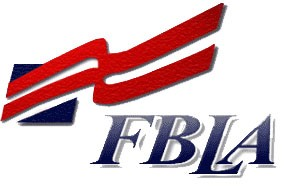

Introduction to Business and Technology

Course Syllabus

2019-2020

Screven County High School

Instructor: Mr. Alex Collins

Classroom: 407

Phone: 912.451.2300

Email: alex.collins\@screven.k12.ga.us

**Course Description:**

Introduction to Business & Technology is the foundational course for
Business and Technology, Entrepreneurship, and Human Resources
Management pathways. The course is designed for high school students as
a gateway to the career pathways above, and provides an overview of
business and technology skills required for today\'s business
environment. Knowledge of business principles, the impact of financial
decisions, and technology proficiencies demanded by business combine to
establish the elements of this course. Emphasis is placed on developing
proficient fundamental computer skills required for all career pathways.
Students will learn essentials for working in a business environment,
managing a business, and owning a business. The intention of this course
is to prepare students to be successful both personally and
professionally in an information-based society. Students will not only
understand the concepts, but apply their knowledge to situations and
defend their actions/decisions/choices through the knowledge and skills
acquired in this course. Employability skills are integrated into
activities, tasks, and projects throughout the course standards to
demonstrate the skills required by business and industry. Competencies
in the co-curricular student organization, Future Business Leaders of
America (FBLA), are integral components of both the employability skills
standards and content standards for this course.

Various forms of technologies will be highlighted to expose students to
the emerging technologies impacting the business world. Professional
communication skills and practices, problem-solving, ethical and legal
issues, and the impact of effective presentation skills are taught in
this course as a foundational knowledge to prepare students to be
college and career ready. Introduction to Business & Technology is a
course that is appropriate for all high school students. After mastery
of the standards in this course, students should be prepared to earn an
industry recognized credential: Microsoft Office Specialist for Word
Core Certification. The pre-requisite for this course is advisor
approval.

**Course Requirements:**

-   Open mind

-   Desire to do something

-   Pen (black and red), pencil, 3 ring notebook, composition book, and
    paper

**Co-curriculum:**

-   This is a co-curricular course and the topics covered will be
    foundations of FBLA.

-   Students are encouraged to join and participate in FBLA.

**Classroom Rules, Guidelines, and Expectations:**

-   Students will abide by the rules outlined in the class and in the
    SCHS handbook

-   Students will be prepared

-   Student will participate and complete assignments to the best of
    their abilities

**Consequences:**

-   Students violating classroom rules and guidelines will experiences
    an escalating scale of consequences:

    -   Verbal/written warning

    -   In School Detention

    -   Parental contact

    -   Referral

-   Students should understand that this is a learning environment and
    disciplinary actions are not the intent, but a consequence.

**Grading Rubric:**

-   Daily Grades -- 50%

-   Tests and Projects -- 50%

-   There will be an exam at the end of the semester that will count 20%
    of the students overall semester grade.

-   Students will be given a work ethic grade twice a semester that will
    count in their Daily Grades.

**Work Ethic Grade:**

-   You will receive a daily grade after every week of a project.
    (minimum 2 daily grades per semester).

-   You will start with a grade of 100. You will be marked off 5 points
    for every infraction. You could get more than 5 points marked off in
    a day.

-   The minimum grade you could receive is a zero.

-   If you want to know where you stand at the end of each week, it is
    your responsibility to come by before school or after school if you
    do not have time during class.

-   Your work ethic will be graded in the following areas:

  **Attendance**   **Behavior**           **Preparation**
  ---------------- ---------------------- -----------------
  ISS              Excessive Talking      Materials
  Suspension       Idle(not doing work)   Homework
  Tardy            Laying head down       
  Restroom         Rude                   
  Nurse            Food/Drink/Gum         
                   Other school rules     

**Make Up Work:**

-   Students are expected to make up any tests that were missed as a
    result of their absence the day the return. Students are responsible
    for getting missed assignments within two days of returning from an
    excused absence. Students will have five days to complete and turn
    in missed assignments. It is the responsibility of the student to
    check with the teacher upon returning to school to make up any
    missed assignments.

-   Work outside of the windows mentioned above will be taken, but at a
    discount. A student turning in an assignment late or for unexcused
    makeup will be given only 70% of their earned grade. That is, Johnny
    didn't turn in his homework on Monday, but turned it in on Friday.
    After it was graded, he scored 80%. Since it was late, it will be a
    56%. Remember, this is better than a zero any day of the week.

**Topics Covered:**

-   Entrepreneurship

-   Microsoft Word

-   Employability

-   Management and Leadership Skills

-   Marketing and Communication Skills

-   Human Resources

-   Financial Decision Making

This syllabus is subject to change at the discretion of the teacher.

**Behavior Matrix:**

-   The behavior matrix is introduced and discussed as a part of the
    class.

-   The behavior matrix is posted with the school with behavior matrix
    in the classroom.

This syllabus is subject to change at the discretion of the teacher.
